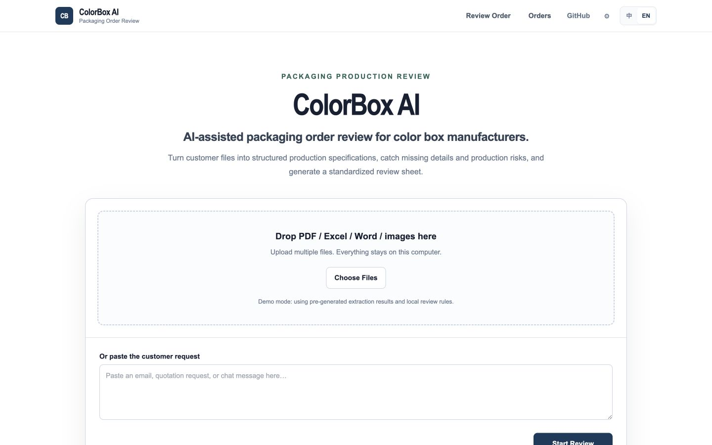
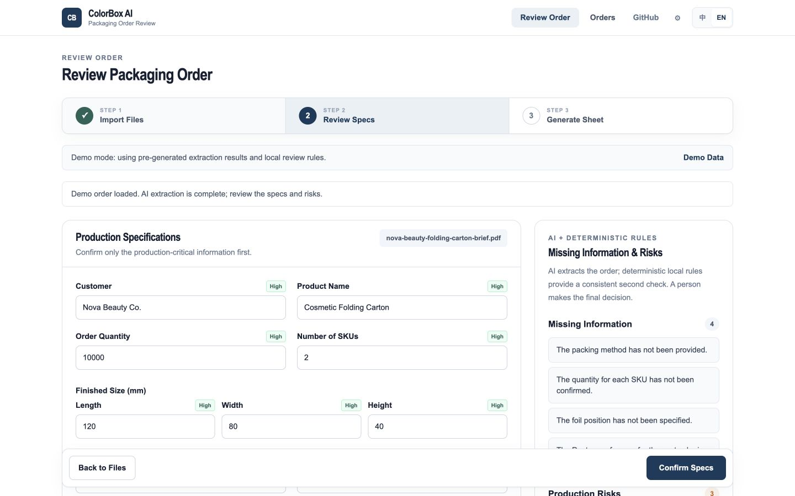
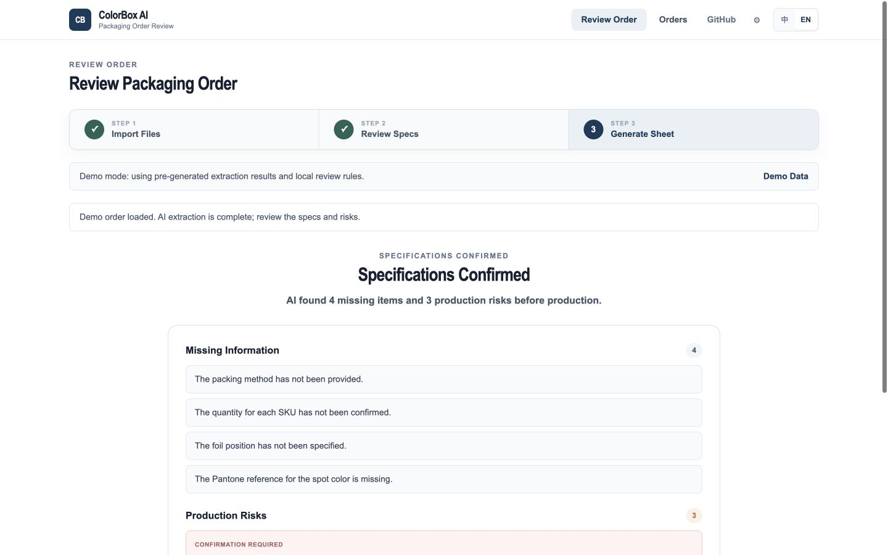
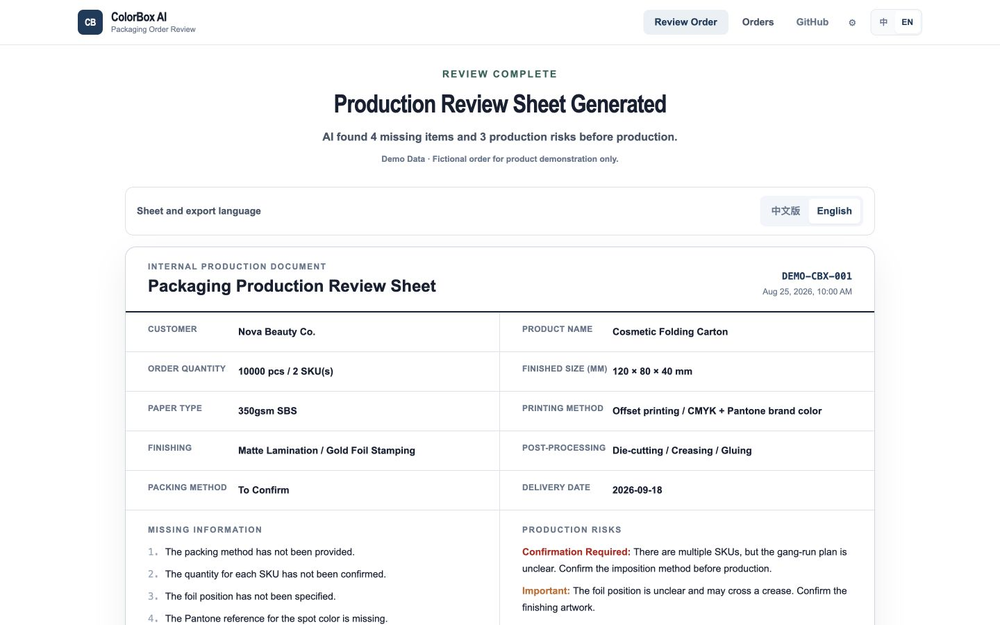
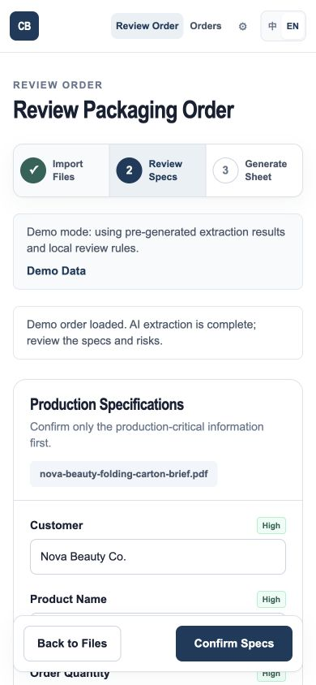

# ColorBox AI

**Upload packaging order files, extract production specs, detect missing information and risks, then generate a clean production review sheet.**

[Try the public demo](https://colorbox-ai.vercel.app) · [中文说明](./README.zh-CN.md)



## Core workflow

```text
Upload customer files → AI extracts production specifications
→ Deterministic rules check missing information and risks
→ Human confirms the important fields → Generate production review sheet
```

ColorBox AI is designed around a **real-world factory workflow**: sales imports a customer inquiry, AI structures the flexible input, stable local rules check production-critical gaps, and a person approves the result before it becomes an internal work sheet.

## Why it is useful

- Reduce manual order review.
- Catch missing production details early.
- Generate standardized production sheets.

It combines **AI + deterministic rules** with a **human-in-the-loop** review. The system does not blindly trust AI output. AI suggestions remain editable, unrecognized values stay empty, and inferred details are marked for confirmation. It is **production-focused, not a chatbot**.

## Tech stack

Next.js App Router, TypeScript, Tailwind CSS, Prisma, SQLite, Zod, React Hook Form, Zustand, SheetJS, Vitest, ESLint, and Prettier.

## Run locally

Requirements: Node.js 20+ and npm.

```bash
git clone https://github.com/hql7-luo/colorbox-ai.git
cd colorbox-ai
cp .env.example .env
npm install
npm run dev
```

Open [http://localhost:3000](http://localhost:3000), then click **Try Demo** for the shortest walkthrough.

## Product walkthrough

### 1. Extract editable production specifications



### 2. Review missing information and production risks



### 3. Generate a standardized production review sheet



### Responsive and bilingual



The full interface supports English and Chinese. The language switch preserves the current order, workflow step, fields, and local attachments.

## Core features

- Paste customer inquiries or upload PDF, image, Excel, Word, CSV, and text files.
- Extract structured carton, material, printing, finishing, packing, delivery, and file-status fields.
- Validate unified AI JSON with Zod through an OpenAI-compatible service layer.
- Show field confidence and keep every extracted value editable.
- Run independent missing-information and production-risk rules.
- Generate concise customer confirmation questions in Chinese or English.
- Generate, copy, print/save as PDF, and export production review sheets to Excel.
- Save and reopen local order history with SQLite and Prisma.
- Continue in manual/local-rule mode when no AI key is configured.

## Technical design

```text
Browser
  ├─ Three-step review workflow
  ├─ Human confirmation
  └─ Sheet / Excel / print output
          │
Next.js server
  ├─ OpenAI-compatible extraction service → Zod validation
  ├─ Deterministic packaging rules
  ├─ Prisma → SQLite
  └─ Local upload directory
```

Prompts live in `src/lib/ai/prompt.ts`, validation schemas in `src/lib/order-schema.ts`, and factory-editable rules in `src/lib/rules.ts`. API keys are server-side environment variables and are never stored in SQLite.

## AI configuration

Set the following values in `.env`:

```env
AI_API_KEY="your-key"
AI_BASE_URL="https://api.openai.com/v1"
AI_MODEL="your-compatible-model"
```

The service calls an OpenAI-compatible `POST /chat/completions` endpoint. Use a model with image input support when extracting image files. If the endpoint fails or returns invalid JSON, ColorBox AI falls back to local extraction and shows a clear notice.

### No-AI mode

Leave `AI_API_KEY` empty. The local application still supports manual editing, heuristic text extraction, deterministic checks, customer questions, production sheets, Excel export, print/PDF, local order history, and the three seeded Demo orders.

## Public demo vs. local factory mode

| Capability                 | Public Vercel demo            | Local factory mode            |
| -------------------------- | ----------------------------- | ----------------------------- |
| Demo workflow              | Full three-step flow          | Full three-step flow          |
| AI key                     | Not configured                | Optional environment variable |
| Customer file upload       | Disabled                      | Stored locally                |
| Persistent database writes | Disabled                      | SQLite + Prisma               |
| Order data                 | Three read-only sample orders | Persistent local history      |

The public demo uses only fictional data and local review rules. **Do not upload or paste real customer or commercially sensitive information into the public demo.**

## Demo Scenarios

The public demo includes three fictional packaging scenarios and does not require an AI key or database.

Local setup seeds the same three clearly marked fictional orders from the shared Demo source:

| Demo customer     | Product                 | Scenario                                                     |
| ----------------- | ----------------------- | ------------------------------------------------------------ |
| Nova Beauty Co.   | Cosmetic Folding Carton | 350gsm SBS, CMYK, matte lamination, gold foil                |
| Northstar Home    | Corrugated Retail Box   | Printed liner, E-flute corrugated board, water-based coating |
| Lumière Fragrance | Rigid Gift Box          | Wrapped rigid box, silver foil, embossing, EVA insert        |

No real customer, supplier, pricing, margin, or commercial contract data is included.

## Data storage

| Data            | Default local location          |
| --------------- | ------------------------------- |
| SQLite database | `prisma/colorbox.db`            |
| Uploaded files  | `storage/uploads/<session-id>/` |
| Review rules    | `src/lib/rules.ts`              |

The database, uploaded files, environment files, logs, and build caches are excluded from Git. Back up both the SQLite database and upload directory for local factory use.

## Tests

```bash
npm run lint
npm run test
npm run build
```

The test suite covers AI JSON validation, no-key fallback, order persistence, missing/risk rules, SKU arithmetic, status transitions, bilingual customer questions and review sheets, Excel export data, and SQLite create/read behavior. GitHub Actions runs the same checks on pushes and pull requests.

## Factory LAN deployment

```bash
npm run build
npm run start -- --hostname 0.0.0.0 --port 3000
```

Open `http://<server-lan-ip>:3000` from devices on the same network and allow TCP port 3000 through the host firewall. For regular internal use, run the process under a supervisor and schedule backups. V1 assumes a trusted factory LAN; add VPN or reverse-proxy authentication before remote access.

## Privacy and security

- Customer files remain in the configured local upload directory.
- Files reach a third-party AI endpoint only after an operator starts extraction with an AI key configured.
- The Settings page reports configuration status without exposing the complete key.
- Upload paths, extensions, and sizes are validated.
- The public repository and public demo contain fictional Demo data only.

## Known limitations

- V1 has no user accounts, roles, or complex permissions.
- `.docx` text is parsed; legacy `.doc` files are only stored and downloaded.
- PDF export uses browser print and “Save as PDF.”
- Local extraction is heuristic and always requires human confirmation.
- Local-only mode has no OCR engine for text embedded in images.
- Automatic quotation, ERP, inventory, scheduling, finance, CRM, email sending, and production image inspection are intentionally out of scope.

## License

[MIT](./LICENSE) © 2026 Haoqi Luo
