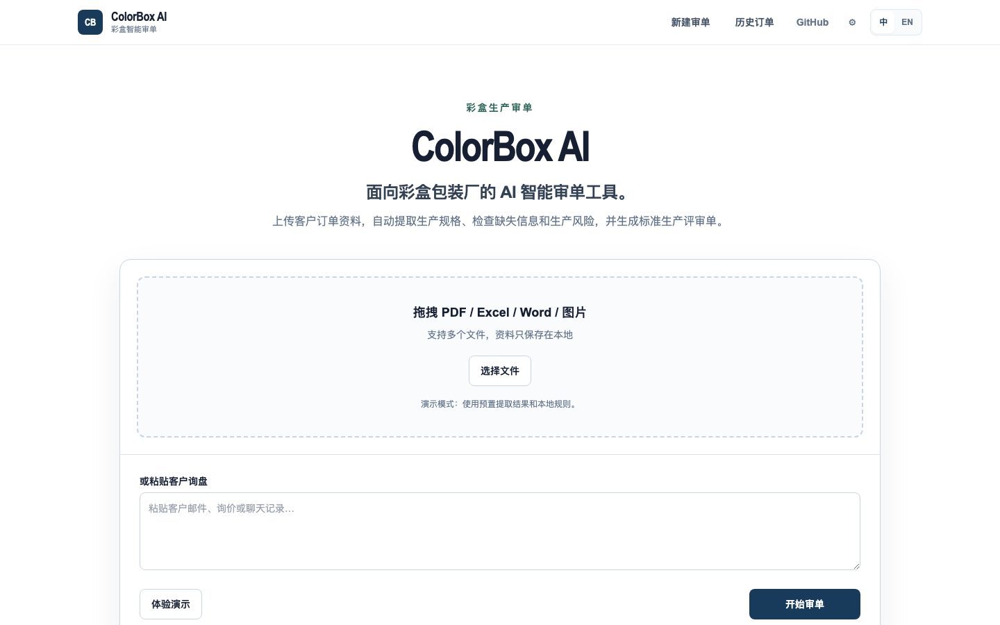

# ColorBox AI｜彩盒智能审单系统

**上传彩盒订单资料，自动提取生产规格、检查缺失和风险，并生成标准生产评审单。**

[体验公开 Demo](https://colorbox-ai.vercel.app) · [English README](./README.md)



## 核心工作流

```text
上传客户资料 → AI 提取生产规格
→ 确定性规则检查缺失信息与风险
→ 人工确认关键字段 → 生成标准生产评审单
```

ColorBox AI 围绕**真实工厂流程**设计：业务员导入客户询盘，AI 将灵活输入整理成规格，本地规则稳定检查生产关键信息，人工确认后再生成内部工单。

## 为什么有用

- 减少人工审单时间。
- 在生产前发现缺失信息。
- 标准化业务到生产的交接。

系统采用 **AI + 确定性规则 + 人工确认**。系统不会盲目信任 AI 输出；AI 建议始终可编辑，未识别值保持为空，推测内容明确标记为待确认。它**面向生产，不是聊天机器人**。

## 技术栈

Next.js App Router、TypeScript、Tailwind CSS、Prisma、SQLite、Zod、React Hook Form、Zustand、SheetJS、Vitest、ESLint、Prettier。

## 本地运行

需要 Node.js 20+ 和 npm。

```bash
git clone https://github.com/hql7-luo/colorbox-ai.git
cd colorbox-ai
cp .env.example .env
npm install
npm run dev
```

打开 [http://localhost:3000](http://localhost:3000)，点击**体验演示**即可用最短路径查看完整流程。

## 产品流程

### 1. AI 提取并人工修改生产规格


### 2. 检查缺失信息与生产风险


### 3. 生成标准生产评审单


### 移动端与全站双语


全站支持中文和 English；切换语言不会丢失当前订单、步骤、表单内容或本地附件。

## 核心功能

- 粘贴客户询盘，或上传 PDF、图片、Excel、Word、CSV、文本文件。
- 提取彩盒、材料、印刷、表面工艺、包装、交期和文件状态等结构化字段。
- 通过独立 OpenAI 兼容服务层调用 AI，并使用 Zod 验证统一 JSON。
- 显示字段置信度，所有 AI 字段均可人工修改。
- 使用独立本地规则检查缺失信息与生产风险。
- 生成简洁自然的中英文客户确认问题。
- 生成、复制、打印/另存 PDF、导出 Excel 生产评审单。
- 使用 SQLite + Prisma 保存并重新打开本地历史订单。
- 未配置 AI Key 时仍可使用手动填写和本地规则。

## 技术设计

```text
浏览器
  ├─ 三步审单流程
  ├─ 人工确认
  └─ 工单 / Excel / 打印输出
          │
Next.js 服务端
  ├─ OpenAI 兼容提取服务 → Zod 验证
  ├─ 确定性彩盒审单规则
  ├─ Prisma → SQLite
  └─ 本地上传目录
```

提示词位于 `src/lib/ai/prompt.ts`，验证 Schema 位于 `src/lib/order-schema.ts`，便于工厂调整的规则位于 `src/lib/rules.ts`。API Key 只从服务端环境变量读取，不保存到 SQLite。

## AI 配置

在 `.env` 设置：

```env
AI_API_KEY="你的密钥"
AI_BASE_URL="https://api.openai.com/v1"
AI_MODEL="兼容模型名称"
```

服务端调用 OpenAI 兼容的 `POST /chat/completions`。识别图片时应选择支持图片输入的模型。AI 接口失败或返回无效 JSON 时，系统会自动回退到本地提取，并显示明确提示。

### 无 AI 模式

保持 `AI_API_KEY` 为空即可。系统仍支持手工修改、启发式文字提取、确定性检查、客户确认问题、生产评审单、Excel、打印/PDF、本地历史订单和 3 条 Demo 数据。

## 公开 Demo 与本地工厂版

| 能力             | Vercel 公开 Demo | 本地工厂版      |
| ---------------- | ---------------- | --------------- |
| 三步 Demo 流程   | 完整支持         | 完整支持        |
| AI Key           | 不配置           | 可选环境变量    |
| 客户文件上传     | 禁用             | 保存到本地      |
| 数据库持久写入   | 禁用             | SQLite + Prisma |
| 订单数据生命周期 | 仅当前浏览器会话 | 本地长期保存    |

公开 Demo 只使用虚构数据和本地审单规则。**不要在公开 Demo 粘贴或上传真实客户资料、报价或商业敏感信息。**

## Demo 数据

项目会写入 3 条明确标记的虚构订单：

| Demo 客户         | 产品                    | 场景                             |
| ----------------- | ----------------------- | -------------------------------- |
| Nova Beauty Co.   | Cosmetic Folding Carton | 350gsm SBS、CMYK、哑膜、烫金     |
| Northstar Home    | Corrugated Retail Box   | 彩印面纸、E 楞、水性光油         |
| Lumière Fragrance | Rigid Gift Box          | 天地盖礼盒、烫银、击凸、EVA 内托 |

项目不包含真实客户、供应商、报价、利润率或商业合同数据。

## 数据存储

| 数据          | 本地默认位置                  |
| ------------- | ----------------------------- |
| SQLite 数据库 | `prisma/colorbox.db`          |
| 上传文件      | `storage/uploads/<会话编号>/` |
| 审单规则      | `src/lib/rules.ts`            |

数据库、上传文件、环境变量文件、日志和构建缓存均排除在 Git 之外。本地工厂使用时，请同时备份 SQLite 数据库和上传目录。

## 测试

```bash
npm run lint
npm run test
npm run build
```

测试覆盖 AI JSON 验证、无 Key 回退、订单保存、缺失/风险规则、SKU 计算、状态变化、中英文客户问题和工单、Excel 数据，以及 SQLite 创建与读取。GitHub Actions 会在推送和 Pull Request 时运行相同检查。

## 工厂局域网部署

```bash
npm run build
npm run start -- --hostname 0.0.0.0 --port 3000
```

同一网络内的设备访问 `http://<服务器局域网IP>:3000`，并在主机防火墙放行 TCP 3000 端口。长期使用建议通过守护进程运行并定时备份。V1 默认面向可信工厂局域网；远程访问前应增加 VPN 或带身份认证的反向代理。

## 数据隐私与安全

- 客户附件保存在配置的本地上传目录。
- 只有配置 AI Key 且操作员开始提取后，资料才会发送到第三方 AI 接口。
- 设置页只显示配置状态，不展示完整密钥。
- 上传路径、扩展名和文件大小均有校验。
- 公开仓库与公开 Demo 只包含虚构演示数据。

## 已知限制

- V1 没有账号、角色和复杂权限。
- 自动解析 `.docx` 正文；旧版 `.doc` 只保存和下载。
- PDF 通过浏览器打印并选择“另存为 PDF”。
- 本地提取属于启发式识别，必须人工确认。
- 无 AI 模式没有针对图片文字的本地 OCR。
- 自动报价、ERP、库存、排期、财务、CRM、自动邮件和生产图像质检均明确不在 V1 范围。

## License

[MIT](./LICENSE) © 2026 Haoqi Luo
